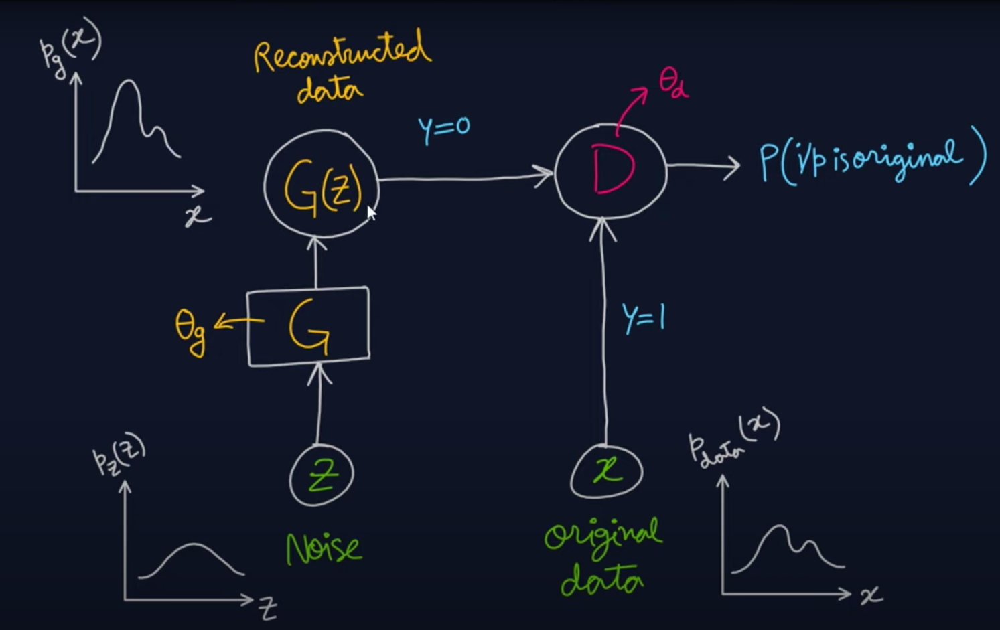
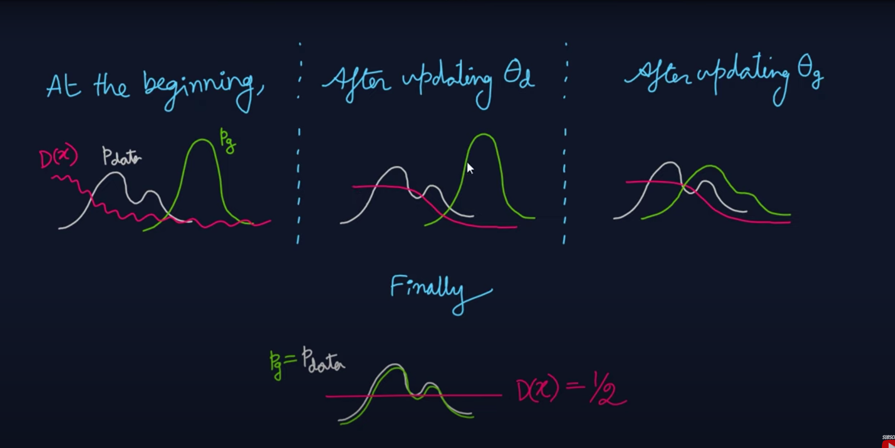
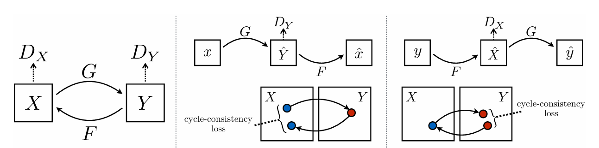
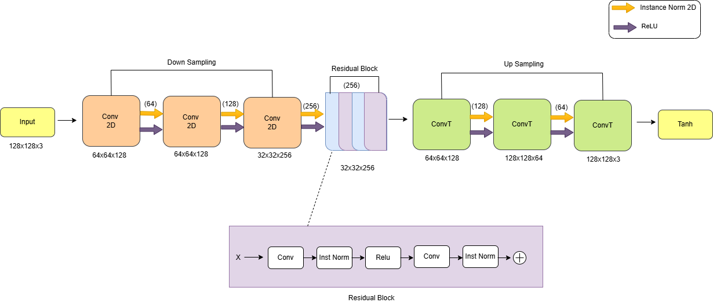
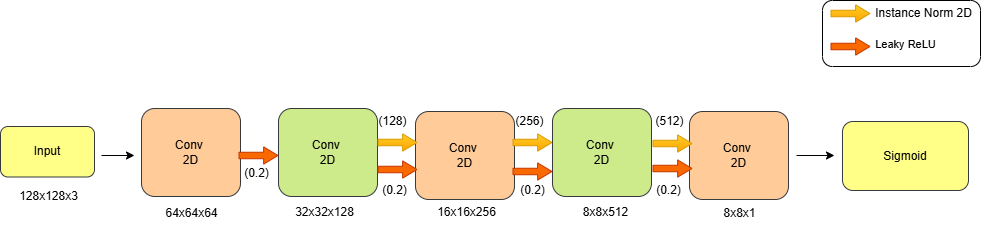
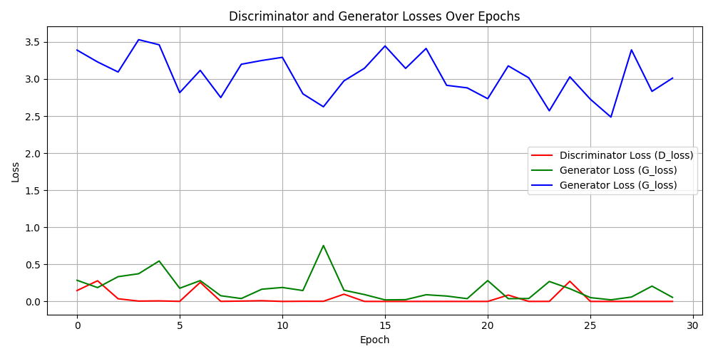
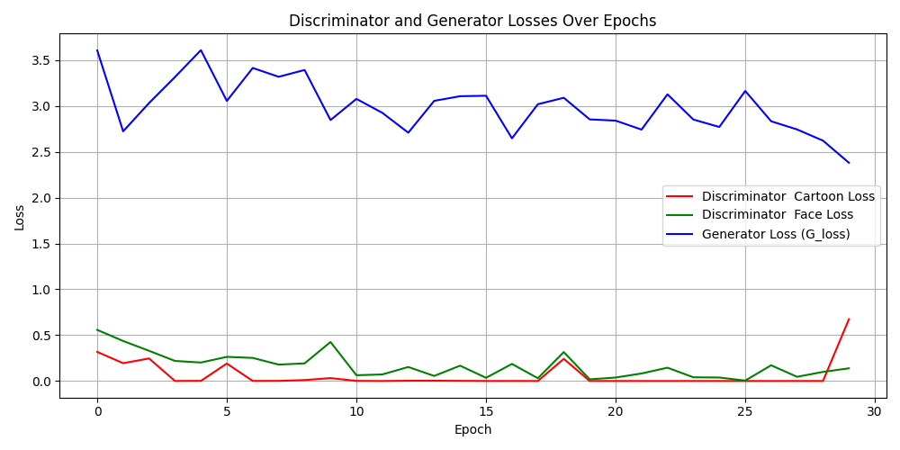
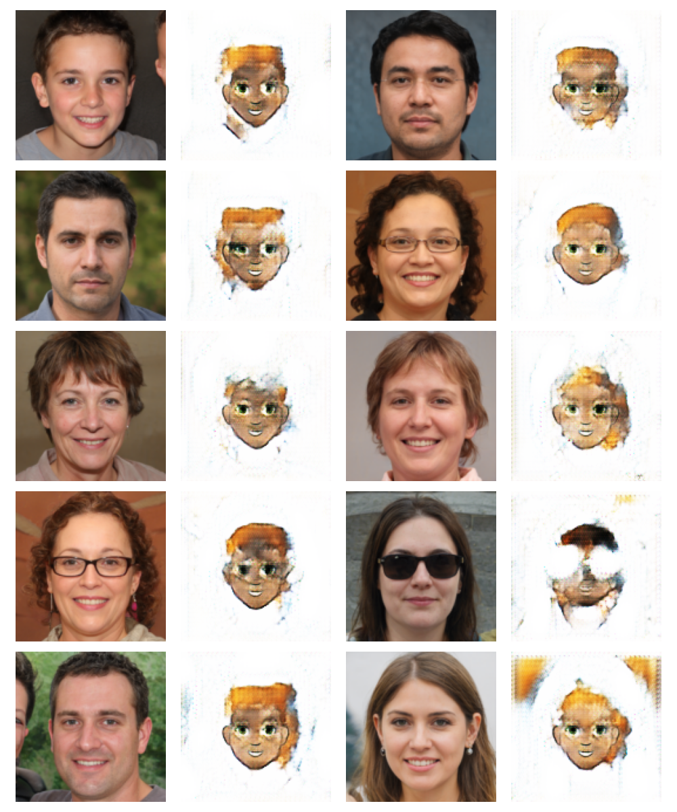

# Human Face to Cartoon Conversion using Reduced CycleGAN

## 📌 Motivation & Reasoning
We all have an innate desire to visualize ourselves as fictional characters, whether in movies, cartoons, or fantasy worlds. The concept of transforming real-life images into artistic representations intrigued us, pushing us to explore this creative domain. 

Initially, we set out to generate LEGO-style versions of images, but after facing multiple challenges and technical limitations in producing structured and realistic outputs, we had to reconsider our approach. 

Determined to find a better solution, we pivoted to cartoon-style transformations. This shift allowed us to refine our model, improve learning mechanisms, and achieve more meaningful results while still upholding the essence of artistic reimagination. 

## 📌 Understanding GANs and CycleGAN
Generative Adversarial Networks (GANs) are a class of deep learning models that consist of two neural networks—a generator and a discriminator—competing against each other. The generator attempts to create realistic images, while the discriminator evaluates them against real samples, leading to continuous improvements in quality. Traditional GANs require paired data, where input-output mappings are clearly defined. This necessity makes them ideal for applications where exact transformations between images are available.




CycleGAN, on the other hand, is designed to work with unpaired data, making it particularly useful for tasks where finding corresponding image pairs is impractical. Unlike a standard GAN, CycleGAN consists of two generator-discriminator pairs that learn bidirectional mappings between two domains. It introduces a cycle consistency loss, which ensures that an image transformed from domain A to domain B and back to A remains unchanged. This mechanism helps maintain realistic translations, making CycleGAN highly effective for style transfer applications such as converting real-world images into cartoons. 



In our project, we leverage CycleGAN to seamlessly translate input images into their artistic representations while maintaining essential features. This approach enables us to generate high-quality, visually appealing transformations that stay true to the original content. 


---
## 📌 Dataset

This project uses two datasets:
1. [**CartoonSet**](https://google.github.io/cartoonset/): A collection of 2D cartoon avatars with different artistic styles.
   - 500 images for training
   - 10 images for testing
2. [**Human Dataset**](https://www.kaggle.com/datasets/prasoonkottarathil/face-mask-lite-dataset): **Face Mask Lite Dataset** from Kaggle, containing real human face images.
   - 500 images without masks for training
   - 10 images for testing

### Data Augmentation:

- **White Background Removal**: Ensures consistency with transparent cartoon backgrounds.
- **Glasses Removal**: Prevents inconsistencies in translation.
- **Front-Facing Image Selection**: Uses only front-facing images to improve accuracy.


   

---
## 📌 Architecture


## Our Approach 
In our approach, we modified the CycleGAN architecture to enhance training speed and reduce memory usage, while maintaining output quality.<br>

To improve efficiency and performance, our implementation reduces the number of residual blocks from 6 to 4, speeding up training while maintaining quality. We also avoid using a learning rate scheduler to simplify training dynamics. Additionally, mixed-precision training with gradient scaling is employed to optimize GPU memory usage and accelerate computations. These enhancements contribute to a more stable and effective CycleGAN model, making it well-suited for high-quality image translation.

## Generator


## Discriminator

 
### Key differences include:
1. Residual Blocks: Reduced the number of residual blocks in the generator from 6 to 4 to simplify the model and speed up training.<br>

2. Learning Rate Scheduler: Omitted the learning rate scheduler from the original design to streamline the model.<br>

3. Mixed-Precision Training: Incorporated gradient scaling with mixed-precision training to improve efficiency, reduce memory usage, and handle larger models or datasets without exceeding GPU capacity.<br>

4. Discriminator: Using an 8×8 PatchGAN discriminator reduces computational cost, avoids global artifacts, and improves training efficiency by evaluating realism at the patch level rather than the whole image.


---

## Loss Function 

- **Criterion for GAN Loss:** Using Mean Squared Error (MSE) loss to measure the difference between generated images and real images.

- **Cycle Consistency Loss:** L1 Loss ensures that when the model maps a cartoon back to a face, it should resemble the original face.

- **Identity Loss:** Another L1 Loss to ensure identity preservation between images (e.g., when a face image is passed through the cartoon generator, it should stay consistent).

---
##  Optimizer

- **Adam Optimizer for Discriminators:** Optimizes both discriminators (D_cartoon and D_face) with learning rate 0.0002 and betas (0.5, 0.999) for smoother updates.

- **Adam Optimizer for Generators:** Optimizes both generators (G_cartoon and G_face) with the same parameters as discriminators for balanced updates.

- **Grad Scalers for Generators and Discriminators:** Uses AMP for faster training with less memory usage on GPUs by scaling gradients to avoid overflow during backpropagation.

---

## 📌 Results
### 4 Residual Blocks


### 6 Residual Blocks


The 4 residual block model successfully generated cartoonized images, demonstrating that even with fewer residual blocks, the model retained its ability to learn the transformation. However, certain challenges emerged:

- The 4 RB model struggled with backgrounds, failing to properly separate the subject from the surroundings. This resulted in inconsistent or incomplete cartoonization when the subject was not in a plain setting.
- Hair color reproduction was noticeably weaker compared to the 6 RB model. The generated hair tones often appeared faded or incorrect, suggesting that fewer residual blocks limited the model’s capacity to capture fine details.
- General structure and facial features were preserved, but the 6 RB model produced more refined outputs with better texture consistency and color accuracy.

The 6 residual block model, as used in the original paper, exhibited superior results, particularly in handling hair color and background effects. While not perfect, it was better at distinguishing the subject from the background and maintaining color consistency.

## 📌 Loss Functions

### 4 RB Loss/Residual Plot


### 6 RB Loss/Residual Plot


Both models were trained for only 50 epochs and with a small dataset due to computational limitations. Given these constraints, the 4 RB model was still able to achieve reasonable results, indicating that with more training data and longer training cycles, it could potentially match the performance of the 6 RB model.

This suggests that a 4 residual block architecture, when properly trained, could serve as a computationally efficient alternative, reducing resource usage without significant loss of quality. Further optimization strategies could help bridge the gap between 4 RB and 6 RB performance, making the lighter model a viable choice for real-world applications.

---

## 📌 Challenges
### with weights<br>


### using linear schedular<br>


### 80 epoch<br>


### Failed to match<br>


### with glasses<br>


---
## 📌 References

1. https://www.reddit.com/r/node/comments/yd99nb/alternatives_to_ngrok/ (static domain) <br>
2. https://ngrok.com/blog-post/free-static-domains-ngrok-users <br>
3. https://stackoverflow.com/questions/63732353/error-could-not-build-wheels-for-opencv-python-which-use-pep-517-and-cannot-be <br>
4. https://medium.com/imagescvwhat-is-cyclegan-and-how-to-use-it-2bfc772e6195 <br>
5. https://abdulkaderhelwan.medium.com/how-to-train-a-deep-cyclegan-for-mobile-style-transfer-bd73a16bfc19 <br>
6. https://medium.com/@chilldenaya/cyclegan-introduction-pytorch-implementation-5b53913741ca <br>
7. https://jonathan-hui.medium.com/gan-cyclegan-6a50e7600d7 <br>
8. https://www.youtube.com/watch?v=Gib_kiXgnvA <br>
9. https://arxiv.org/pdf/1406.2661 <br>
10. https://jonathan-hui.medium.com/gan-whats-generative-adversarial-networks-and-its-application-f39ed278ef09 <br>
11. https://www.youtube.com/watch?v=5jziBapziYE <br>
12. https://arxiv.org/pdf/1703.10593 <br>
13. https://ieeexplore.ieee.org/stamp/stamp.jsp?tp=&arnumber=9587703 <br>
14. https://github.com/junyanz/CycleGAN?tab=readme-ov-file <br>
15. https://github.com/rish-16/CycleGANsformer <br>
16. https://github.com/lmtri1998/Face2Anime-using-CycleGAN <br>

---
### Prerequisites:

- Python 3.8+
- PyTorch
- torchvision
- Pillow
- tqdm
- matplotlib
- cuda

### Installation:

```bash
git clone https://github.com/hritiksauw199/Human-to-Cartoon-using-CycleGAN.git
cd Human-to-Cartoon-using-CycleGAN
pip install -r requirements.txt
```

### Running the Model:

```bash
python cyclegan.py
```


## 📌 Authors

This project was developed by:

- **Hritik Sauw**
- **Zabihullah Azimy**
- **Ayushi Chawade**
